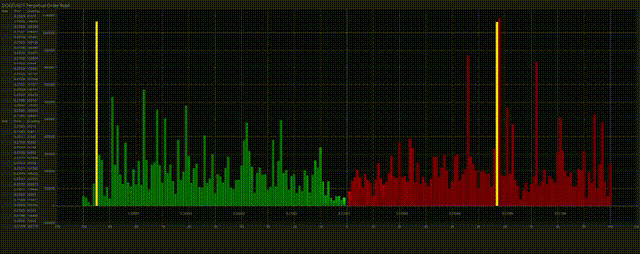

# BINANCE PERP L3 Order Book Estimator



This project is a real-time visualization tool for the Binance perpetual swap order book. The tool uses L2 data's change in time to naively estimate a L3 order book microstructure. we can change to more complex model to estimate the L3 book later.

## Features

* **Real-time Data**: Streams order book data using Binance's WebSocket API.
* **Bid/Ask Visualization**: Displays the current bids and asks for the binance perpetual swap.
* **Order Queue Estimation**: Estimates the order queue at each price level using L2 data.
* **Dynamic Bar Coloring**: Bid and ask bars are dynamically colored based on the age of the order.

## Usage

To try the project, you'll need to have Rust installed on your system. You can install it from [https://www.rust-lang.org/](https://www.rust-lang.org/).

1. Clone the repository:

```bash
git clone https://github.com/OctopusTakopi/binance_l3_est.git
cd binance_l3_est
```

add cmd arg the trading pair you want to see
```bash
cargo run -r dogeusdt
```

The chart dynamically updates as new WebSocket messages are received, and the bars for bids and asks are color-coded based on the order age.

#### P.S. You need enough time to wait for the estimator to start working based on the history L2 data.

## License

This project is licensed under the MIT License - see the [LICENSE](LICENSE) file for details.

---

## Todo

- [ ] Add Cluster Algo on orders and display them with different color